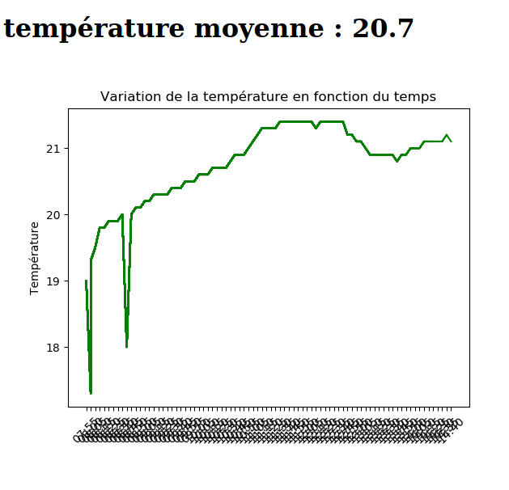

# Projet domotic
> Interface web de monitoring de la température relevé par un capteur.

## Table of contents
- [Projet domotic](#projet-domotic)
  - [Table of contents](#table-of-contents)
  - [General info](#general-info)
  - [Screenshots](#screenshots)
  - [Technologies](#technologies)
  - [Setup](#setup)
  - [Code Examples](#code-examples)
  - [Features](#features)
  - [Status](#status)
  - [Inspiration](#inspiration)
  - [Contact](#contact)

## General info
Add more general information about project. What the purpose of the project is? Motivation?

Ce projet me permet de suivre à travers une interface web la température dans ma chambre.

## Screenshots


## Technologies
* Tech 1 - version 1.0
* Tech 2 - version 2.0
* Tech 3 - version 3.0

## Setup
Describe how to install / setup your local environement / add link to demo version.

- 1 Raspberry Pi
- 1 capteur 

## Code Examples
Show examples of usage:
`put-your-code-here`

afin d'avoir de l'aide : ```./src main -h```

lance le programme dans son mode par défaut avec une prise de mesure toutes les **5 minutes** : ```./src/main.py```

## Features
List of features ready and TODOs for future development
* Awesome feature 1
* Awesome feature 2
* Awesome feature 3

To-do list:
* Wow improvement to be done 1
* Wow improvement to be done 2

## Status
Project is: _in progress_, _finished_, _no longer continue_ and why?

## Inspiration
Add here credits. Project inspired by..., based on...

- https://raspberry-lab.fr/Projets/Courbe-temperature-accessible-avec-un-server-Web-Python/
- Github README formating : https://docs.github.com/en/free-pro-team@latest/github/writing-on-github/basic-writing-and-formatting-syntax

## Contact
Created by [@gwendalpenvern](gwendalpenvern@protonmail.com) - feel free to contact me!